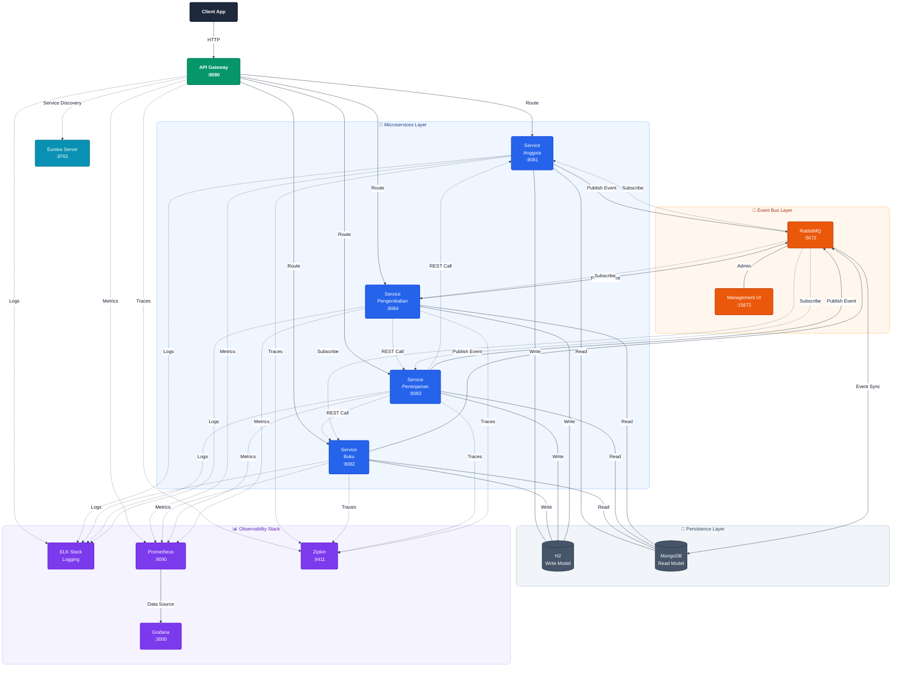

# 📚 Sistem Microservices Perpustakaan

<div align="center">


**Sistem manajemen perpustakaan enterprise-grade dengan arsitektur microservices, implementasi CQRS pattern, Event-Driven Architecture menggunakan RabbitMQ, CI/CD pipeline, monitoring & tracing terdistribusi**

[Fitur](#-fitur-utama) • [Arsitektur](#-arsitektur-sistem) • [Quick Start](#-quick-start) • [Dokumentasi](#-dokumentasi-api) • [Monitoring](#-monitoring--observability)

</div>

---

## 🎯 Fitur Utama

<table>
<tr>
<td width="50%">

### 🏗️ **Architecture & Patterns**
- ✅ **CQRS Pattern** - Command Query Responsibility Segregation
- ✅ **Event-Driven Architecture** - Asynchronous messaging dengan RabbitMQ
- ✅ **Message Broker** - RabbitMQ untuk inter-service communication
- ✅ **Service Discovery** - Netflix Eureka
- ✅ **API Gateway** - Spring Cloud Gateway dengan routing
- ✅ **Circuit Breaker** - Resilience4j untuk fault tolerance
- ✅ **Load Balancing** - Client-side load balancing

</td>
<td width="50%">

### 🔧 **DevOps & Operations**
- ✅ **CI/CD Pipeline** - Jenkins automation
- ✅ **Containerization** - Docker & Docker Compose
- ✅ **Distributed Logging** - ELK Stack (Elasticsearch, Logstash, Kibana)
- ✅ **Metrics Monitoring** - Prometheus + Grafana
- ✅ **Distributed Tracing** - Zipkin
- ✅ **Message Queue Monitoring** - RabbitMQ Management UI
- ✅ **Health Monitoring** - Spring Boot Actuator
- ✅ **API Documentation** - OpenAPI/Swagger aggregation
- ✅ **Graceful Shutdown** - Zero-downtime deployments

</td>
</tr>
</table>

---

## 🏛️ Arsitektur Sistem



### 📦 Komponen Utama

| Komponen | Port | Teknologi | Fungsi |
|----------|------|-----------|--------|
| **Eureka Server** | 8761 | Spring Cloud Netflix | Service Registry & Discovery |
| **API Gateway** | 8080 | Spring Cloud Gateway | Routing, Load Balancing, Circuit Breaker |
| **Service Anggota** | 8081 | Spring Boot + CQRS | Manajemen data anggota perpustakaan |
| **Service Buku** | 8082 | Spring Boot + CQRS | Manajemen katalog buku |
| **Service Peminjaman** | 8083 | Spring Boot + CQRS | Transaksi peminjaman buku |
| **Service Pengembalian** | 8084 | Spring Boot + CQRS | Proses pengembalian & denda |
| **RabbitMQ** | 5672 | RabbitMQ 3.13 | Message Broker untuk Event-Driven Architecture |
| **RabbitMQ Management** | 15672 | RabbitMQ Management | Web UI untuk monitoring queue & exchange |
| **MongoDB** | 27017 | MongoDB 6.0 | Read Model Database (CQRS) |
| **Elasticsearch** | 9200 | Elastic 8.11 | Log storage & indexing |
| **Logstash** | 5000 | Logstash 8.11 | Log processing pipeline |
| **Kibana** | 5601 | Kibana 8.11 | Log visualization dashboard |
| **Prometheus** | 9090 | Prometheus Latest | Metrics collection & storage |
| **Grafana** | 3000 | Grafana Latest | Metrics visualization & dashboards |
| **Zipkin** | 9411 | Zipkin Latest | Distributed tracing system |
| **Jenkins** | 9000 | Jenkins LTS | CI/CD Automation |

---

## 🚀 Quick Start

### Prerequisites

```bash
# Required software
- Java 17 or higher
- Maven 3.9+
- Docker 20.10+
- Docker Compose v2+

# System requirements
- RAM: 8GB minimum (16GB recommended)
- CPU: 4 cores minimum
- Disk: 20GB free space
```

### 🔥 One-Command Setup

```bash
# Clone repository
git clone https://github.com/erlaaaand/micro-services-perpustakaan.git
cd perpustakaan-microservices

# Start semua services dengan Docker Compose
docker-compose up -d
```

### 📊 Verification

Setelah startup (tunggu ~2-3 menit), akses:

**Core Services:**
- **Eureka Dashboard**: http://localhost:8761
- **API Gateway**: http://localhost:8080
- **Swagger UI Gateway**: http://localhost:8080/swagger-ui.html

**Monitoring & Observability:**
- **Prometheus**: http://localhost:9090
- **Grafana**: http://localhost:3000 (username: `admin`, password: `admin`)
- **Zipkin Tracing**: http://localhost:9411
- **RabbitMQ Management**: http://localhost:15672 (username: `guest`, password: `guest`)
- **Kibana Logs**: http://localhost:5601

---

## 📖 Dokumentasi Lengkap

Dokumentasi lengkap tersedia di folder [`docs/`](docs/):

### 📚 Dokumentasi Utama

- **[Setup Guide](docs/SETUP_GUIDE.md)** - Panduan lengkap setup dari awal
- **[Architecture](docs/ARCHITECTURE.md)** - Detail arsitektur sistem dan design patterns
- **[API Reference](docs/API_REFERENCE.md)** - Dokumentasi lengkap semua API endpoints
- **[CQRS Implementation](docs/CQRS.md)** - Penjelasan implementasi CQRS pattern
- **[Event-Driven Architecture](docs/EVENT_DRIVEN.md)** - Dokumentasi RabbitMQ dan event flow

### 🔧 Operasional

- **[Monitoring Guide](docs/MONITORING.md)** - Panduan monitoring dengan Prometheus, Grafana, Zipkin, dan ELK
- **[CI/CD Pipeline](docs/CICD.md)** - Setup dan konfigurasi Jenkins pipeline
- **[Development Guide](docs/DEVELOPMENT.md)** - Panduan development dan best practices
- **[Troubleshooting](docs/TROUBLESHOOTING.md)** - Common issues dan solusinya
- **[Production Checklist](docs/PRODUCTION.md)** - Checklist untuk production deployment

### 📊 Referensi Teknis

- **[Configuration Files](docs/CONFIGURATION.md)** - Penjelasan semua file konfigurasi
- **[Database Schema](docs/DATABASE.md)** - Schema H2 dan MongoDB
- **[Performance Tuning](docs/PERFORMANCE.md)** - Optimasi performa sistem
- **[Security Guide](docs/SECURITY.md)** - Best practices keamanan

---

## 🧪 Testing

```bash
# Run unit tests
mvn test

# Run integration tests
mvn verify

# Test API endpoints
curl http://localhost:8080/api/anggota
```

Lihat [Development Guide](docs/DEVELOPMENT.md) untuk detail testing.

---

## 📂 Project Structure

```
perpustakaan-microservices/
├── 📁 eureka-server/              # Service Discovery
├── 📁 api-gateway/                # API Gateway & Routing
├── 📁 service-anggota/            # Member Management (CQRS)
├── 📁 service-buku/               # Book Catalog (CQRS)
├── 📁 service-peminjaman/         # Borrowing Service (CQRS)
├── 📁 service-pengembalian/       # Return Service (CQRS)
├── 📁 monitoring/                 # Monitoring configurations
│   ├── 📁 prometheus/
│   ├── 📁 grafana/
│   ├── 📁 kibana/
│   └── 📁 logstash/
├── 📁 docs/                       # Dokumentasi lengkap
├── 📄 docker-compose.yml         # Docker orchestration
├── 📄 Jenkinsfile                # CI/CD pipeline
├── 📄 Dockerfile-jenkins         # Custom Jenkins image
└── 📄 README.md                  # This file
```

---

## 🤝 Contributing

Contributions are welcome! Please follow these steps:

1. Fork repository
2. Create feature branch (`git checkout -b feature/AmazingFeature`)
3. Commit changes (`git commit -m 'Add AmazingFeature'`)
4. Push to branch (`git push origin feature/AmazingFeature`)
5. Open Pull Request

Lihat [Development Guide](docs/DEVELOPMENT.md) untuk coding standards.

---

## 📝 License

This project is licensed under the **MIT License** - see LICENSE file for details.

---

## 📞 Support & Contact

Untuk pertanyaan atau bantuan:
- 📧 Email: blackpenta98@gmail.com
- 🐛 Issues: [GitHub Issues](https://github.com/erlaaaand/micro-services-perpustakaan/issues)
- 💬 Discussions: [GitHub Discussions](https://github.com/erlaaaand/micro-services-perpustakaan/discussions)

---

## 🙏 Acknowledgments

- Spring Boot team for amazing framework
- Netflix OSS for Eureka
- RabbitMQ team for reliable messaging
- Elastic for ELK Stack
- Prometheus & Grafana communities
- Docker & containerization ecosystem

---

<div align="center">

**[⬆ Back to Top](#-sistem-microservices-perpustakaan)**

Built using Java, Spring Boot, RabbitMQ, and modern DevOps practices

**⭐ Star this repository if you find it helpful!**

</div>