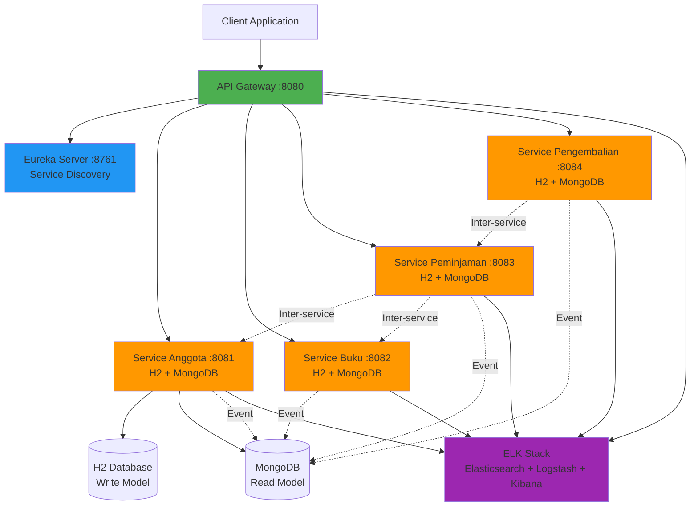

# 📚 Sistem Microservices Perpustakaan

<div align="center">


**Sistem manajemen perpustakaan enterprise-grade dengan arsitektur microservices, implementasi CQRS pattern, CI/CD pipeline, dan monitoring terdistribusi**

[Fitur](#-fitur-utama) • [Arsitektur](#-arsitektur-sistem) • [Quick Start](#-quick-start) • [Dokumentasi](#-dokumentasi-api) • [Monitoring](#-monitoring--observability)

</div>

---

## 🎯 Fitur Utama

<table>
<tr>
<td width="50%">

### 🏗️ **Architecture & Patterns**
- ✅ **CQRS Pattern** - Command Query Responsibility Segregation
- ✅ **Event-Driven Architecture** - Internal event publishing
- ✅ **Service Discovery** - Netflix Eureka
- ✅ **API Gateway** - Spring Cloud Gateway dengan routing
- ✅ **Circuit Breaker** - Resilience4j untuk fault tolerance
- ✅ **Load Balancing** - Client-side load balancing

</td>
<td width="50%">

### 🔧 **DevOps & Operations**
- ✅ **CI/CD Pipeline** - Jenkins automation
- ✅ **Containerization** - Docker & Docker Compose
- ✅ **Distributed Logging** - ELK Stack (Elasticsearch, Logstash, Kibana)
- ✅ **Health Monitoring** - Spring Boot Actuator
- ✅ **API Documentation** - OpenAPI/Swagger aggregation
- ✅ **Graceful Shutdown** - Zero-downtime deployments

</td>
</tr>
</table>

---

## 🏛️ Arsitektur Sistem



### 📦 Komponen Utama

| Komponen | Port | Teknologi | Fungsi |
|----------|------|-----------|--------|
| **Eureka Server** | 8761 | Spring Cloud Netflix | Service Registry & Discovery |
| **API Gateway** | 8080 | Spring Cloud Gateway | Routing, Load Balancing, Circuit Breaker |
| **Service Anggota** | 8081 | Spring Boot + CQRS | Manajemen data anggota perpustakaan |
| **Service Buku** | 8082 | Spring Boot + CQRS | Manajemen katalog buku |
| **Service Peminjaman** | 8083 | Spring Boot + CQRS | Transaksi peminjaman buku |
| **Service Pengembalian** | 8084 | Spring Boot + CQRS | Proses pengembalian & denda |
| **MongoDB** | 27017 | MongoDB 6.0 | Read Model Database (CQRS) |
| **Elasticsearch** | 9200 | Elastic 8.11 | Log storage & indexing |
| **Logstash** | 5000 | Logstash 8.11 | Log processing pipeline |
| **Kibana** | 5601 | Kibana 8.11 | Log visualization dashboard |
| **Jenkins** | 9000 | Jenkins LTS | CI/CD Automation |

---

## 🚀 Quick Start

### Prerequisites

```bash
# Required software
- Java 17 or higher
- Maven 3.9+
- Docker 20.10+
- Docker Compose v2+

# System requirements
- RAM: 8GB minimum (16GB recommended)
- CPU: 4 cores minimum
- Disk: 20GB free space
```

### 🔥 One-Command Setup

```bash
# Clone repository
git clone <repository-url>
cd perpustakaan-microservices

# Build semua services
./build-all.sh

# Start semua services dengan Docker Compose
docker-compose up -d

# Verifikasi health status
./deploy.sh health
```

### 📊 Verification

Setelah startup (tunggu ~2-3 menit), akses:

- **Eureka Dashboard**: http://localhost:8761
- **API Gateway**: http://localhost:8080
- **Swagger UI Gateway**: http://localhost:8080/swagger-ui.html
- **Kibana Logs**: http://localhost:5601

---

## 🎨 CQRS Pattern Implementation

Sistem ini mengimplementasikan **CQRS (Command Query Responsibility Segregation)** untuk memisahkan operasi write dan read:

```
┌─────────────────────────────────────────────────────────┐
│                    CLIENT REQUEST                        │
└─────────────────────────────────────────────────────────┘
                          │
                          ▼
          ┌───────────────────────────────┐
          │      API Gateway (8080)       │
          └───────────────────────────────┘
                          │
          ┌───────────────┴────────────────┐
          │                                │
          ▼                                ▼
┌─────────────────┐              ┌─────────────────┐
│    COMMAND      │              │     QUERY       │
│   (Write/H2)    │              │  (Read/Mongo)   │
│                 │              │                 │
│ - Create        │              │ - Get by ID     │
│ - Update        │──────Event───▶│ - Get All      │
│ - Delete        │              │ - Search        │
└─────────────────┘              └─────────────────┘
```

**Keuntungan CQRS:**
- ✅ Scalability: Read & Write dapat di-scale independent
- ✅ Performance: Optimasi query untuk read operations
- ✅ Flexibility: Model berbeda untuk Command & Query
- ✅ Event Sourcing Ready: Event-driven synchronization

---

## 📖 Dokumentasi API

### 🔹 Service Anggota (Member Management)

**Base URL**: `http://localhost:8080/api/anggota`

#### Create Member
```bash
POST /api/anggota
Content-Type: application/json

{
  "nomorAnggota": "A001",
  "nama": "John Doe",
  "alamat": "Jl. Merdeka No. 123",
  "email": "john@example.com"
}
```

#### Get All Members
```bash
GET /api/anggota?page=0&size=10&sortBy=nama
```

#### Get Member by ID
```bash
GET /api/anggota/{id}
```

#### Update Member
```bash
PUT /api/anggota/{id}
Content-Type: application/json

{
  "nomorAnggota": "A001",
  "nama": "John Doe Updated",
  "alamat": "Jl. Updated No. 456",
  "email": "john.updated@example.com"
}
```

#### Delete Member
```bash
DELETE /api/anggota/{id}
```

---

### 🔹 Service Buku (Book Catalog)

**Base URL**: `http://localhost:8080/api/buku`

#### Create Book
```bash
POST /api/buku
Content-Type: application/json

{
  "kodeBuku": "BK-001",
  "judul": "Java Programming",
  "pengarang": "John Doe",
  "penerbit": "Erlangga",
  "tahunTerbit": 2020
}
```

#### Get All Books
```bash
GET /api/buku?page=0&size=10&sortBy=judul
```

---

### 🔹 Service Peminjaman (Borrowing)

**Base URL**: `http://localhost:8080/api/peminjaman`

#### Create Borrowing Transaction
```bash
POST /api/peminjaman
Content-Type: application/json

{
  "anggotaId": 1,
  "bukuId": 1,
  "tanggalPinjam": "2024-01-01",
  "tanggalKembali": "2024-01-15",
  "status": "DIPINJAM"
}
```

#### Get Borrowing with Details (Inter-service call)
```bash
GET /api/peminjaman/{id}

# Response includes aggregated data:
{
  "peminjaman": { ... },
  "anggota": { "nama": "John Doe", ... },
  "buku": { "judul": "Java Programming", ... }
}
```

---

### 🔹 Service Pengembalian (Return & Fines)

**Base URL**: `http://localhost:8080/api/pengembalian`

#### Create Return Transaction
```bash
POST /api/pengembalian
Content-Type: application/json

{
  "peminjamanId": 1,
  "tanggalDikembalikan": "2024-01-20",
  "terlambat": 5,
  "denda": 25000.0
}
```

---

## 🔍 Monitoring & Observability

### 📊 ELK Stack (Logging)

**Kibana Dashboard**: http://localhost:5601

#### Setup Index Pattern
1. Buka Kibana → Management → Stack Management
2. Pilih **Index Patterns** → **Create index pattern**
3. Masukkan pattern: `logs-*`
4. Pilih timestamp field: `@timestamp`
5. Klik **Create index pattern**

#### View Logs
1. Buka **Discover** menu
2. Filter berdasarkan service:
   ```
   app_name: "service-anggota"
   app_name: "service-buku"
   ```
3. Gunakan KQL query untuk searching

### 🩺 Health Checks

```bash
# Check all services
./deploy.sh health

# Individual service health
curl http://localhost:8761/actuator/health  # Eureka
curl http://localhost:8080/actuator/health  # Gateway
curl http://localhost:8081/actuator/health  # Service Anggota
curl http://localhost:8082/actuator/health  # Service Buku
curl http://localhost:8083/actuator/health  # Service Peminjaman
curl http://localhost:8084/actuator/health  # Service Pengembalian
```

---

## 🔧 CI/CD Pipeline

### Jenkins Setup

1. **Akses Jenkins**: http://localhost:9000

2. **Get Initial Password**:
```bash
docker exec jenkins cat /var/jenkins_home/secrets/initialAdminPassword
```

3. **Install Required Plugins**:
   - Docker Pipeline
   - Maven Integration
   - Git Plugin

4. **Configure Credentials**:
   - Docker Hub: `docker-hub-credentials`
   - Username & Password

5. **Create Pipeline**:
   - New Item → Pipeline
   - Pipeline script from SCM
   - Repository URL: `<your-repo-url>`
   - Script Path: `Jenkinsfile`

### Pipeline Stages

```
┌──────────────┐   ┌──────────────┐   ┌──────────────┐
│  Initialize  │──▶│   Checkout   │──▶│ Build & Test │
└──────────────┘   └──────────────┘   └──────────────┘
                                              │
                                              ▼
┌──────────────┐   ┌──────────────┐   ┌──────────────┐
│ Health Check │◀──│    Deploy    │◀──│  Push Docker │
└──────────────┘   └──────────────┘   └──────────────┘
```

---

## 🛠️ Development Guide

### Build Individual Service

```bash
cd service-anggota
mvn clean package -DskipTests
```

### Run Service Locally

```bash
# Start Eureka first
cd eureka-server
mvn spring-boot:run

# Then start other services
cd service-anggota
mvn spring-boot:run
```

### Environment Variables

Buat file `.env` di root project:

```properties
# Eureka
EUREKA_SERVER_URL=http://localhost:8761/eureka/

# MongoDB
MONGODB_URI_ANGGOTA=mongodb://localhost:27017/anggota_db
MONGODB_URI_BUKU=mongodb://localhost:27017/buku_db
MONGODB_URI_PEMINJAMAN=mongodb://localhost:27017/peminjaman_db
MONGODB_URI_PENGEMBALIAN=mongodb://localhost:27017/pengembalian_db

# ELK Stack
ELASTICSEARCH_HOSTS=http://localhost:9200
LOGSTASH_HOST=localhost
LOGSTASH_PORT=5000
```

---

## 🐛 Troubleshooting

### Services Not Starting

```bash
# Check logs
docker-compose logs -f [service-name]

# Restart specific service
docker-compose restart [service-name]

# Clean rebuild
docker-compose down
docker-compose up -d --build
```

### Port Already in Use

```bash
# Find process using port (Linux/Mac)
lsof -i :8080

# Find process using port (Windows)
netstat -ano | findstr :8080

# Kill process
kill -9 <PID>  # Linux/Mac
taskkill /PID <PID> /F  # Windows
```

### MongoDB Connection Issues

```bash
# Verify MongoDB is running
docker ps | grep mongodb

# Check MongoDB logs
docker logs mongodb

# Connect to MongoDB shell
docker exec -it mongodb mongosh
```

### Eureka Registration Issues

1. Tunggu 30-60 detik untuk service registration
2. Check Eureka dashboard: http://localhost:8761
3. Verify `eureka.client.register-with-eureka=true` di application.properties
4. Check network connectivity: `docker network inspect perpustakaan-network`

---

## 📂 Project Structure

```
perpustakaan-microservices/
├── 📁 eureka-server/              # Service Discovery
├── 📁 api-gateway/                # API Gateway & Routing
├── 📁 service-anggota/            # Member Management (CQRS)
│   ├── 📁 cqrs/
│   │   ├── command/              # Write operations
│   │   ├── query/                # Read operations
│   │   └── handler/              # Command/Query handlers
│   ├── 📁 entity/
│   │   ├── command/              # Write model (H2)
│   │   └── query/                # Read model (MongoDB)
│   ├── 📁 repository/
│   │   ├── command/              # JPA Repository
│   │   └── query/                # MongoDB Repository
│   └── 📁 event/                 # Event publishing
├── 📁 service-buku/               # Book Catalog (CQRS)
├── 📁 service-peminjaman/         # Borrowing Service (CQRS)
├── 📁 service-pengembalian/       # Return Service (CQRS)
├── 📁 monitoring/
│   ├── 📁 kibana/                # Kibana config
│   └── 📁 logstash/              # Logstash pipeline
├── 📄 docker-compose.yml         # Docker orchestration
├── 📄 Jenkinsfile                # CI/CD pipeline
├── 📄 .env.example               # Environment template
├── 📄 build-all.sh               # Build automation
└── 📄 deploy.sh                  # Deployment script
```

---

## 🧪 Testing

### Unit Tests

```bash
# Run tests for specific service
cd service-anggota
mvn test

# Run all tests
mvn clean verify
```

### Integration Tests

```bash
# With coverage report
mvn clean test jacoco:report

# View coverage report
open target/site/jacoco/index.html
```

### API Testing with Postman

1. Import collection: `postman/perpustakaan-api.json`
2. Set environment variables
3. Run test suite

---

## 🔐 Security Notes

⚠️ **Development Mode**: Konfigurasi saat ini untuk development/testing

**Production Checklist**:
- [ ] Enable Spring Security
- [ ] Configure JWT authentication
- [ ] Setup HTTPS/SSL certificates
- [ ] Use secrets management (Vault)
- [ ] Enable Actuator security
- [ ] Configure CORS properly
- [ ] Setup rate limiting
- [ ] Enable audit logging

---

## 📈 Performance Tuning

### JVM Options

Edit `JAVA_OPTS` di docker-compose.yml:

```yaml
environment:
  - JAVA_OPTS=-Xmx1g -Xms512m -XX:+UseG1GC
```

### MongoDB Indexing

```javascript
// Connect to MongoDB
docker exec -it mongodb mongosh

// Create indexes
use anggota_read_db
db.anggota_read.createIndex({ "nomorAnggota": 1 })

use buku_read_db
db.buku_read.createIndex({ "kodeBuku": 1 })
```

---

## 🤝 Contributing

Contributions are welcome! Please follow these steps:

1. Fork repository
2. Create feature branch (`git checkout -b feature/AmazingFeature`)
3. Commit changes (`git commit -m 'Add AmazingFeature'`)
4. Push to branch (`git push origin feature/AmazingFeature`)
5. Open Pull Request

---

## 📝 License

This project is licensed under the **MIT License** - see LICENSE file for details.

---

## 🎓 Learning Resources

- [Spring Cloud Documentation](https://spring.io/projects/spring-cloud)
- [CQRS Pattern](https://martinfowler.com/bliki/CQRS.html)
- [Microservices Architecture](https://microservices.io/)
- [Docker Documentation](https://docs.docker.com/)
- [MongoDB Best Practices](https://docs.mongodb.com/manual/)

---

## 📞 Support & Contact

Untuk pertanyaan atau bantuan:
- 📧 Email: team@perpustakaan.com
- 🐛 Issues: [GitHub Issues](https://github.com/username/repo/issues)
- 💬 Discussions: [GitHub Discussions](https://github.com/username/repo/discussions)

---

<div align="center">

**[⬆ Back to Top](#-sistem-microservices-perpustakaan)**

Built with Java, Spring Boot, and passion for clean architecture

</div>